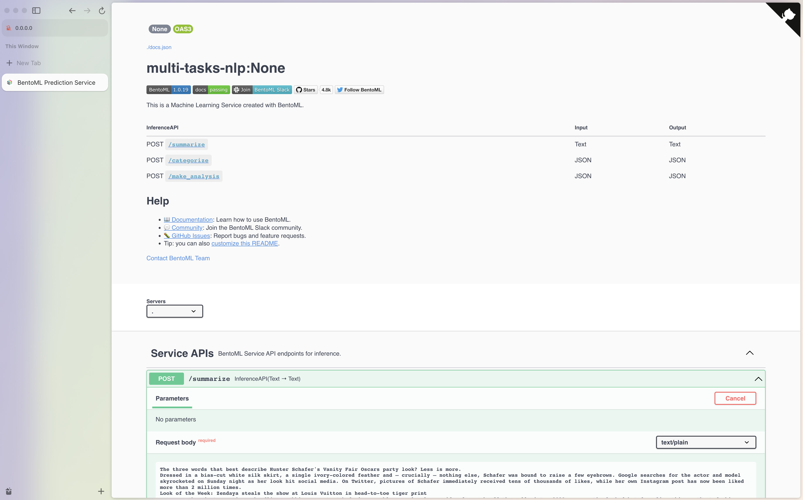

# NLP multi-task service

A modular, composable, and scalable solution for building NLP services, powered by BentoML 🍱 + HuggingFace 🤗


👉 [Pop into our Slack community!](https://l.linklyhq.com/l/ktO8) We're happy to help with any issue you face or even just to meet you and hear what you're
working on.

## Shortcuts

* [Running this project from a container](#container)
* [Clone me 🤗](#git-clone--recommended-)
* [Interacting with the service](#interacting-with-the-service)
* [Sending requests in Python](#python)
* [How about calling service in JS?](#javascript)
* [Server, Client and Inference Python API](#i-want-to-use-python-api)
* [How about gRPC?](#grpc-)
* [NLP tasks support](#what-if-i-want-to-add-tasks--x--)
* [Container deployment](#container-deployment)
* [Serverless with BentoCloud](#serverless)
* [Kubernetes with Yatai](#kubernetes)


## Let's see it in action!

### Git clone (recommended)

You can also clone this repo and run the service locally. This requires python3.8+ and pip installed.

```bash
git clone https://github.com/bentoml/NLP-multi-task-service.git && cd NLP-multi-task-service

pip install -r requirements/tests.txt

bentoml serve
```

You can then open your browser at http://127.0.0.1:3000 to view the Swagger UI to send requests.

### Container

We provide two pre-built container to run on CPU and GPU respectively. This requires any docker container engine, such as docker, podman, ...
You can then quickly try out the service by running the container:

```bash
# cpu
docker run -p 3000:3000 ghcr.io/bentoml/nlp-multi-task-service:cpu

# gpu
docker run --gpus all -p 3000:3000 ghcr.io/bentoml/nlp-multi-task-service:gpu
```

> Note that to run with GPU, you will need to have [nvidia-docker](https://github.com/NVIDIA/nvidia-docker) setup.


## Interacting with the service

### Curl

You can send requests to serivce with curl. The following example shows how to send a request to the service to summarize a text:

```bash
curl -X 'POST' \
  'http://0.0.0.0:3000/summarize' \
  -H 'accept: text/plain' \
  -H 'Content-Type: text/plain' \
  -d 'The three words that best describe Hunter Schafer'\''s Vanity Fair Oscars party look? Less is more.
Dressed in a bias-cut white silk skirt, a single ivory-colored feather and — crucially — nothing else, Schafer was bound to raise a few eyebrows. Google searches for the actor and model skyrocketed on Sunday night as her look hit social media. On Twitter, pictures of Schafer immediately received tens of thousands of likes, while her own Instagram post has now been liked more than 2 million times.
Look of the Week: Zendaya steals the show at Louis Vuitton in head-to-toe tiger print
But more than just creating a headline-grabbing moment, Schafer'\''s ensemble was clearly considered. Fresh off the Fall-Winter 2023 runway, the look debuted earlier this month at fashion house Ann Demeulemeester'\''s show in Paris. It was designed by Ludovic de Saint Sernin, the label'\''s creative director since December.
Celebrity fashion works best when there'\''s a story behind a look. For example, the plausible Edie Sedgwick reference in Kendall Jenner'\''s Bottega Veneta tights, or Paul Mescal winking at traditional masculinity in a plain white tank top.
For his first Ann Demeulemeester collection, De Saint Sernin was inspired by "fashion-making as an authentic act of self-involvement." It was a love letter — almost literally — to the Belgian label'\''s founder, with imagery of "authorship and autobiography" baked into the clothes (Sernin called his feather bandeaus "quills" in the show notes).
Hunter Schafer'\''s barely-there Oscars after party look was more poetic than it first seemed.
These ideas of self-expression, self-love and self-definition took on new meaning when worn by Schafer. As a trans woman whose ascent to fame was inextricably linked to her gender identity — her big break was playing trans teenager Jules in HBO'\''s "Euphoria" — Schafer'\''s body is subjected to constant scrutiny online. The comment sections on her Instagram posts often descend into open forums, where users feel entitled (and seemingly compelled) to ask intimate questions about the trans experience or challenge Schafer'\''s womanhood.
Fittingly, there is a long lineage of gender-defying sentiments stitched into Schafer'\''s outfit. Founded in 1985 by Ann Demeulemeester and her husband Patrick Robyn, the brand boasts a long legacy of gender-non-conforming fashion.
"I was interested in the tension between masculine and feminine, but also the tension between masculine and feminine within one person," Demeulemeester told Vogue ahead of a retrospective exhibition of her work in Florence, Italy, last year. "That is what makes every person really interesting to me because everybody is unique."
In his latest co-ed collection, De Saint Sernin — who is renowned in the industry for his eponymous, gender-fluid label — brought his androgynous world view to Ann Demeulemeester with fitted, romantic menswear silhouettes and sensual fabrics for all (think skin-tight mesh tops, leather, and open shirts made from a translucent organza material).
Celebrity stylist Law Roach on dressing Zendaya and '\''faking it '\''till you make it'\''
A quill strapped across her chest, Schafer let us know she is still writing her narrative — and defining herself on her own terms. There'\''s an entire story contained in those two garments. As De Saint Sernin said in the show notes: "Thirty-six looks, each one a heartfelt sentence."
The powerful ensemble may become one of Law Roach'\''s last celebrity styling credits. Roach announced over social media on Tuesday that he would be retiring from the industry after 14 years of creating conversation-driving looks for the likes of Zendaya, Bella Hadid, Anya Taylor-Joy, Ariana Grande and Megan Thee Stallion.'
```

You can also see the OpenAPI UI at http://127.0.0.1:3000



### Python

We provide a `client.py` file that you can use to send requests to the service:

```bash
python client.py
```

### Javascript

You can send requests to serivce with Javascript via `axios`:

```javascript
import axios from 'axios'

var TEXT = `
The three words that best describe Hunter Schafer's Vanity Fair Oscars party look? Less is more.
Dressed in a bias-cut white silk skirt, a single ivory-colored feather and — crucially — nothing else, Schafer was bound to raise a few eyebrows. Google searches for the actor and model skyrocketed on Sunday night as her look hit social media. On Twitter, pictures of Schafer immediately received tens of thousands of likes, while her own Instagram post has now been liked more than 2 million times.
Look of the Week: Zendaya steals the show at Louis Vuitton in head-to-toe tiger print
But more than just creating a headline-grabbing moment, Schafer's ensemble was clearly considered. Fresh off the Fall-Winter 2023 runway, the look debuted earlier this month at fashion house Ann Demeulemeester's show in Paris. It was designed by Ludovic de Saint Sernin, the label's creative director since December.
Celebrity fashion works best when there's a story behind a look. For example, the plausible Edie Sedgwick reference in Kendall Jenner's Bottega Veneta tights, or Paul Mescal winking at traditional masculinity in a plain white tank top.
For his first Ann Demeulemeester collection, De Saint Sernin was inspired by "fashion-making as an authentic act of self-involvement." It was a love letter — almost literally — to the Belgian label's founder, with imagery of "authorship and autobiography" baked into the clothes (Sernin called his feather bandeaus "quills" in the show notes).
Hunter Schafer's barely-there Oscars after party look was more poetic than it first seemed.
These ideas of self-expression, self-love and self-definition took on new meaning when worn by Schafer. As a trans woman whose ascent to fame was inextricably linked to her gender identity — her big break was playing trans teenager Jules in HBO's "Euphoria" — Schafer's body is subjected to constant scrutiny online. The comment sections on her Instagram posts often descend into open forums, where users feel entitled (and seemingly compelled) to ask intimate questions about the trans experience or challenge Schafer's womanhood.
Fittingly, there is a long lineage of gender-defying sentiments stitched into Schafer's outfit. Founded in 1985 by Ann Demeulemeester and her husband Patrick Robyn, the brand boasts a long legacy of gender-non-conforming fashion.
"I was interested in the tension between masculine and feminine, but also the tension between masculine and feminine within one person," Demeulemeester told Vogue ahead of a retrospective exhibition of her work in Florence, Italy, last year. "That is what makes every person really interesting to me because everybody is unique."
In his latest co-ed collection, De Saint Sernin — who is renowned in the industry for his eponymous, gender-fluid label — brought his androgynous world view to Ann Demeulemeester with fitted, romantic menswear silhouettes and sensual fabrics for all (think skin-tight mesh tops, leather, and open shirts made from a translucent organza material).
Celebrity stylist Law Roach on dressing Zendaya and 'faking it 'till you make it'
A quill strapped across her chest, Schafer let us know she is still writing her narrative — and defining herself on her own terms. There's an entire story contained in those two garments. As De Saint Sernin said in the show notes: "Thirty-six looks, each one a heartfelt sentence."
The powerful ensemble may become one of Law Roach's last celebrity styling credits. Roach announced over social media on Tuesday that he would be retiring from the industry after 14 years of creating conversation-driving looks for the likes of Zendaya, Bella Hadid, Anya Taylor-Joy, Ariana Grande and Megan Thee Stallion."""
`

var CATEGORIES = [
  'world',
  'politics',
  'technology',
  'defence',
  'entertainment',
  'education',
  'healthcare',
  'parliament',
  'economy',
  'infrastructure',
  'business',
  'sport',
  'legal',
]

const client = axios.create({
  baseURL: 'http://localhost:3000',
  timeout: 90000,
})

function getSummarize(text) {
  return client.post('/summarize', text)
}

function getCategorize(text, categories) {
  return client.post('/categorize', { text: text, categories: categories })
}

function makeAnalysis(text, categories) {
  return client.post('/make_analysis', { text: text, categories: categories })
}

Promise.all([
  getSummarize(TEXT),
  getCategorize(TEXT, CATEGORIES),
  makeAnalysis(TEXT, CATEGORIES),
]).then(function (r) {
  const summarize = r[0]
  const categorize = r[1]
  const make_analysis = r[2]

  console.log('Summarize:', summarize)
  console.log('Categorize:', categorize)
  console.log('Full analysis:', make_analysis)
})
```

## I want to use Python API.

BentoML also provides a Python API for serving models.

To start a server, use ``bentoml.HTTPServer``:

```python

import bentoml

bento = bentoml.get("multi-task-nlp")

server = bentoml.HTTPServer(bento, production=True, port=3000)
server.start()
```

To interact with this server, one can also create a client with `bentoml.client.Client`:

```python

client = bentoml.client.Client.from_url("http://127.0.0.1:3000")

result = client.summarize("Try to summarize this text")
```

Note that all API endpoints defined in `service.py` can be access through client through its sync and async methods. For example, the [`service.py`](./service.py) contains three endpoints: `/summarize`, `/categorize` and `/make_analysis`, and hence the following
methods are available on the client instance:

- `client.async_summarize` | `client.summarize`
- `client.async_categorize` | `client.categorize`
- `client.async_make_analysis` | `client.make_analysis`

## gRPC?

If you wish to use gRPC, this project also include gRPC support. To serve gRPC, do

```bash
bentoml serve-grpc
```

To run the container with gRPC, do

```bash
docker run -p 3000:3000 -p 3001:3001 ghcr.io/bentoml/nlp:cpu serve-grpc
```

## Testing

To run the tests, use `pytest`:

```bash
pytest tests
```

## Seems nice, but how can I customize this?

### What if I want to add tasks *X*?
This project is designed to be used with different [NLP tasks](https://huggingface.co/tasks) and its corresponding models:

- [Conversational](https://huggingface.co/tasks/conversational): [`facebook/blenderbot-400M-distill`](https://huggingface.co/facebook/blenderbot-400M-distill)
- [Fill-Mask](https://huggingface.co/tasks/fill-mask): [`distilroberta-base`](https://huggingface.co/distilroberta-base)
- [Question Answering](https://huggingface.co/tasks/question-answering): [`deepset/roberta-base-squad2`](https://huggingface.co/deepset/roberta-base-squad2)
- [Sentence Similarity](https://huggingface.co/tasks/sentence-similarity): [`sentence-transformers/all-MiniLM-L6-v2`](https://huggingface.co/sentence-transformers/all-MiniLM-L6-v2)
- [Summarisation](https://huggingface.co/tasks/summarization): [`sshleifer/distilbart-cnn-12-6`](https://huggingface.co/sshleifer/distilbart-cnn-12-6) [included]
- [Table Question Answering](https://huggingface.co/tasks/table-question-answering): [`google/tapas-base-finetuned-wtq`](https://huggingface.co/google/tapas-base-finetuned-wtq)
- [Text Classification](https://huggingface.co/tasks/text-classification): [`distilbert-base-uncased-finetuned-sst-2-english`](https://huggingface.co/distilbert-base-uncased-finetuned-sst-2-english) [included]
- [Text Generation](https://huggingface.co/tasks/text-generation): [`bigscience/T0pp`](https://huggingface.co/bigscience/T0pp)
- [Token Classification](https://huggingface.co/tasks/token-classification): [`dslim/bert-base-NER`](https://huggingface.co/dslim/bert-base-NER)
- [Zero-Shot Classification](https://huggingface.co/tasks/zero-shot-classification): [`facebook/bart-large-mnli`](https://huggingface.co/facebook/bart-large-mnli)
- [Translation](https://huggingface.co/tasks/translation): [`Helsinki-NLP/opus-mt-en-fr`](https://huggingface.co/Helsinki-NLP/opus-mt-en-fr)

### Where can I add models?

You can add more tasks and models by editing the `download_model.py` file.

### Where can I add API logics?

Pre/post processing logics can be set in the `service.py` file.

### Where can I find more docs about Transformers and BentoML?

BentoML supports Transformers models out of the box. You can find more details in the [BentoML support](https://docs.bentoml.org/en/latest/frameworks/transformers.html) for [Transformers](https://huggingface.co/docs/transformers/index).


## How can I deploy this to production?

We have a few options for you to deploy this service to production:

### Container deployment

If you wish to deploy this as a container, you can use the following:

```bash
bentoml build && bentoml containerize multi-tasks-nlp --opt platform=linux/amd64
```

To build the container with GPU support, you can use the following:

```bash
bentoml build -f bentofile.gpu.yaml && bentoml containerize multi-tasks-nlp-gpu --opt platform=linux/amd64
```

### Serverless

Checkout [BentoCloud](https://www.bentoml.com/bento-cloud/)

### Kubernetes

You might want to use [🦄️ Yatai](https://github.com/bentoml/Yatai) to deploy on our own cluster

### Cloud platforms

To deploy this service any cloud platform services, such as EC2, Sagemaker or Azure function, you might want to use [🚀 bentoctl](https://github.com/bentoml/bentoctl).
